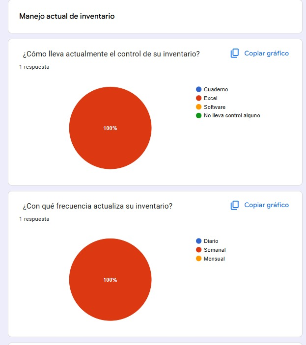
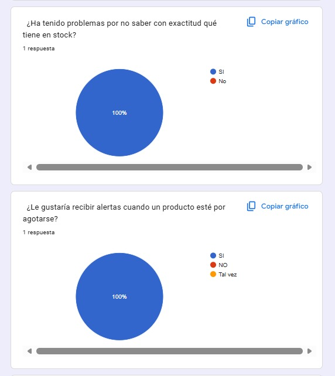
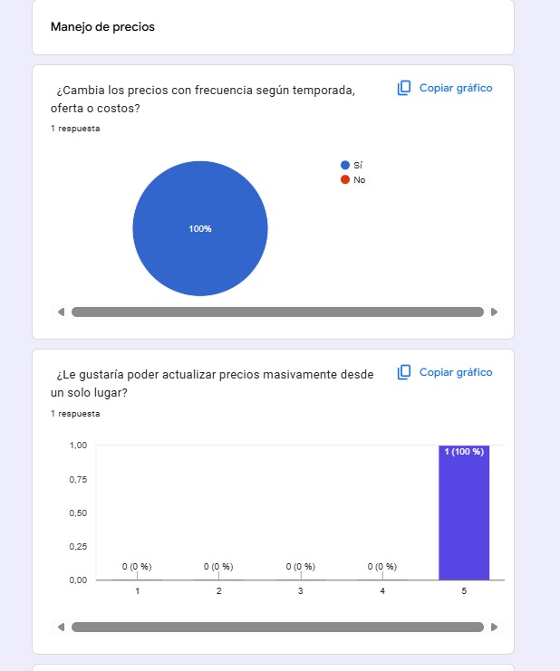
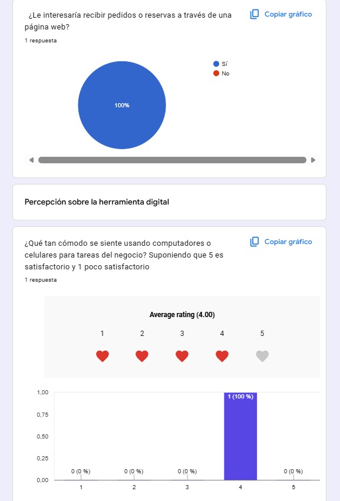

# NATUTECH

NATUTECH es un proyecto que busca conocer la percepción, el nivel de conocimiento y el interés de las personas frente a la integración de la tecnología en soluciones relacionadas con la naturaleza y el medio ambiente. A través de una encuesta aplicada a una muestra representativa de la población objetivo, se recopiló información sobre hábitos, opiniones y necesidades, con el fin de identificar oportunidades de mejora y sustentar decisiones basadas en datos reales.

## 📋 Tabla de contenidos

- [Descripción](#descripción)
- [La encuesta](#la-encuesta)
- [Metodología](#metodología)
- [Resultados estadísticos](#resultados-estadísticos)
- [Conclusiones](#conclusiones)

## Descripción

El objetivo de este proyecto es analizar, mediante una encuesta, la percepción y el nivel de aceptación de las personas hacia el uso de tecnología aplicada al cuidado de la naturaleza y el medio ambiente. Se buscó medir aspectos como el conocimiento previo del tema, la disposición a adoptar soluciones tecnológicas sostenibles y las principales necesidades o barreras percibidas por los encuestados. Este repositorio está dirigido a quienes deseen conocer el proceso de recolección de datos, la encuesta aplicada y los resultados estadísticos

## La encuesta

A continuación se muestran capturas de la encuesta aplicada.

*Figura 1. Primera parte de la encuesta.*

*Figura 2. Segunda parte de la encuesta.*

## Metodología

- **Población objetivo:** Personal encargado de un Vivero Yopal
- **Tamaño de la muestra:** 1
- 
- **Herramienta usada:**  Google Forms
- **Tipo de preguntas:**  Opción múltiple, pregunta abierta

## Resultados estadísticos

Aquí se presentan los resultados obtenidos tras procesar las respuestas.

*Figura 3. Distribución de respuestas a la pregunta general del negocio.*

*Figura 4. Respuestas respecto a situaciones de manejo mercancia*

*Figura 5. Distribución de respuestas precios establecidos.*

*Figura 6. Distribución de respuestas respecto a la atencion que sus clientes.*

*Figura 3. Distribución de respuestas respecto al uso de un sistema de inventario y manejo web.*

## Conclusiones

Dado que la encuesta se aplicó de manera exploratoria a una sola persona —propietario/encargado de un vivero—, los resultados no son estadísticamente representativos, pero sí ofrecen una primera aproximación cualitativa útil para el desarrollo del proyecto. El encuestado mostró interés en adoptar herramientas tecnológicas para su negocio y manifestó su disposición a que el sitio web de NATUTECH se adapte a las necesidades específicas de un vivero (por ejemplo, catálogo de plantas, gestión de pedidos, información de cuidado, etc.).

Esto sugiere que existe una oportunidad real de aplicar el proyecto en un caso de uso concreto, y se recomienda ampliar la muestra a más viveros o negocios similares en una siguiente fase, con el fin de validar estos hallazgos y ajustar el diseño del sitio web a las necesidades comunes del sector.
