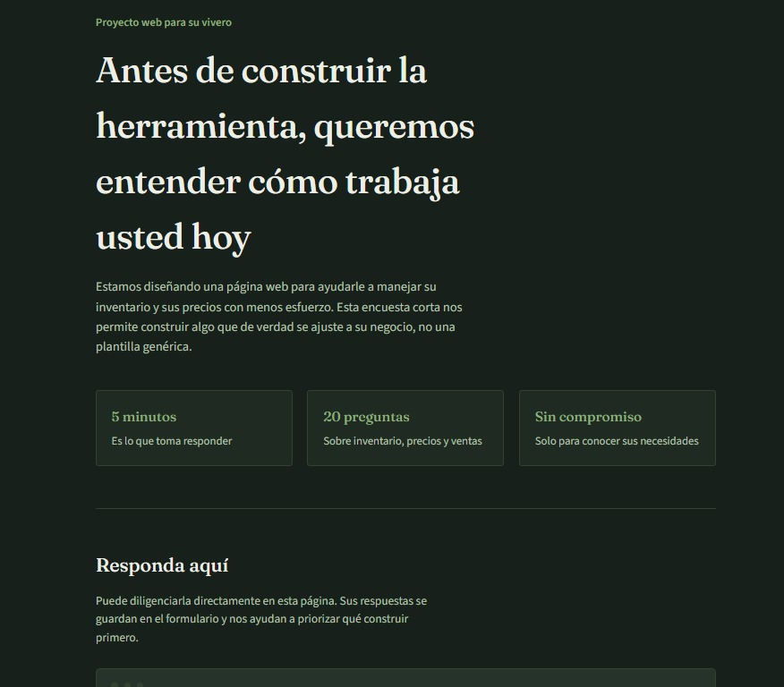
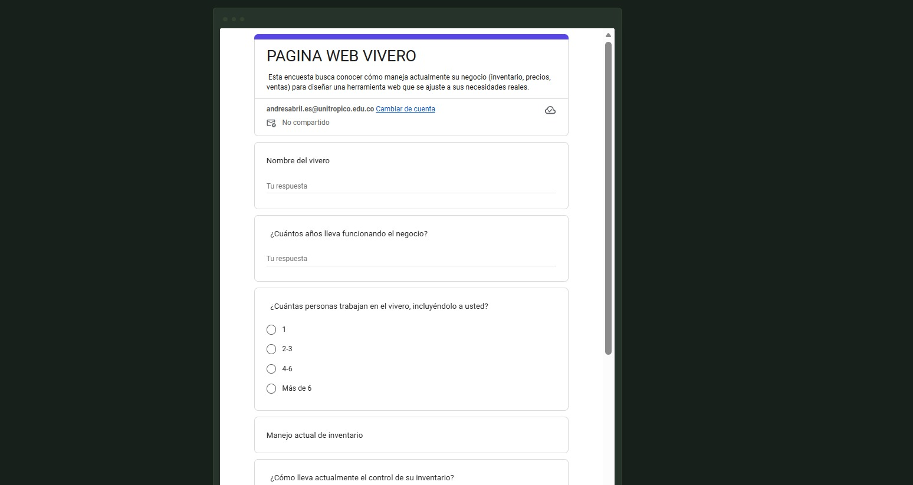
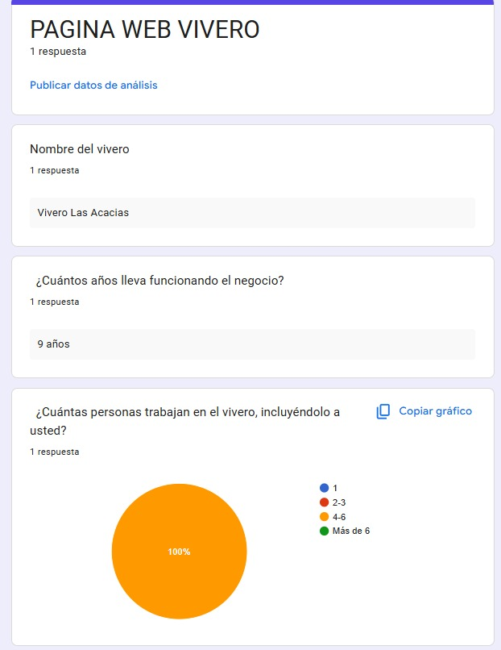
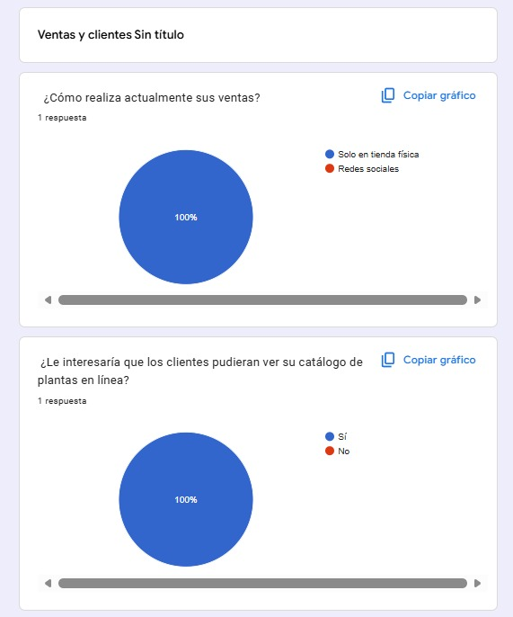
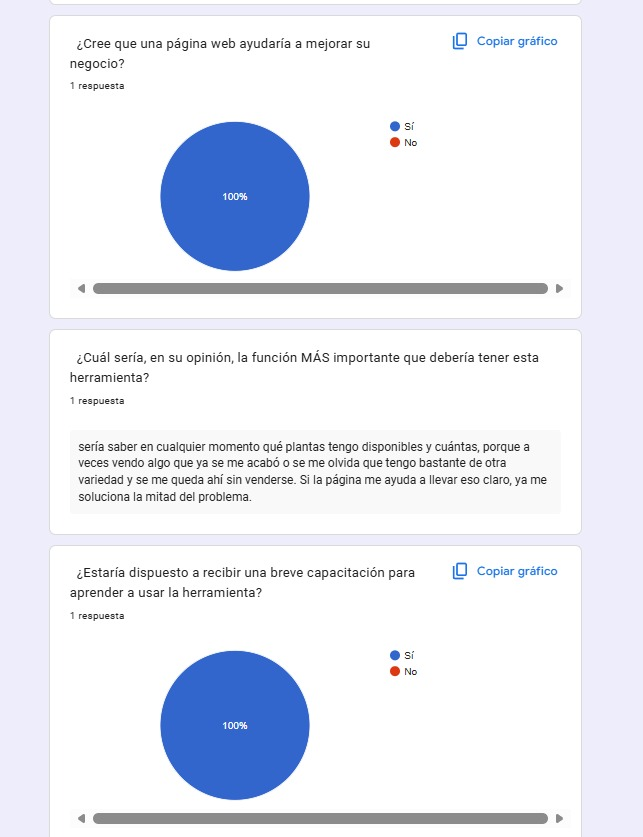

# 🌱 NATUTECH

NATUTECH es un proyecto que busca conocer la percepción, el nivel de conocimiento y el interés de las personas frente a la integración de la tecnología en soluciones relacionadas con la naturaleza y el medio ambiente. A través de una encuesta aplicada a la población objetivo, se recopiló información sobre hábitos, opiniones y necesidades, con el fin de identificar oportunidades de mejora y sustentar decisiones basadas en datos reales.

## 📋 Tabla de contenidos

- [Descripción](#-descripción)
- [La encuesta](#-la-encuesta)
- [Metodología](#-metodología)
- [Resultados estadísticos](#-resultados-estadísticos)
- [Conclusiones](#-conclusiones)

---

## 📖 Descripción

El objetivo de este proyecto es analizar, mediante una encuesta, la percepción y el nivel de aceptación hacia el uso de tecnología aplicada al cuidado de la naturaleza y el manejo de negocios relacionados, como los viveros. Se buscó medir aspectos como el conocimiento previo del tema, la disposición a adoptar soluciones tecnológicas y las principales necesidades o barreras percibidas por el encuestado. Este repositorio está dirigido a quienes deseen conocer el proceso de recolección de datos, la encuesta aplicada y los resultados obtenidos.

---

## 📝 La encuesta

A continuación se muestran capturas de la encuesta aplicada.

| Página 1 | Página 2 |
|:---:|:---:|
|  |  |

*Figura 1 y 2. Encuesta aplicada al encargado del vivero.*

---

## 🔍 Metodología

| Aspecto | Detalle |
|---|---|
| **Población objetivo** | Personal encargado de un vivero en Yopal |
| **Tamaño de la muestra** | 1 persona |
| **Herramienta usada** | Google Forms |
| **Tipo de preguntas** | Opción múltiple y pregunta abierta |

---

## 📊 Resultados estadísticos

Aquí se presentan los resultados obtenidos tras procesar las respuestas.

*Figura 3. Distribución de respuestas a la pregunta general del negocio.*

| Manejo actual de inventario |  |
|:---:|:---:|
|  |  |

*Figura 4. Respuestas respecto a situaciones de manejo de mercancía.*

*Figura 5. Distribución de respuestas sobre precios establecidos.*

*Figura 6. Distribución de respuestas respecto a la atención a sus clientes.*

| Uso de herramienta digital |  |
|:---:|:---:|
|  |  |

*Figura 7. Distribución de respuestas respecto al uso de un sistema de inventario y manejo web.*

---

## ✅ Conclusiones

La encuesta sirvió para tener una primera opinión real sobre el proyecto. Al encargado del vivero le pareció útil la idea y estuvo de acuerdo en que el sitio web se adapte a su negocio, pensando en cosas como mostrar sus plantas, tomar pedidos o dar información básica de cuidado.

Con esto queda claro que el proyecto tiene potencial para aplicarse en un caso real, aunque hace falta encuestar a más viveros para confirmar que estas necesidades se repiten y no son solo de un caso particular.

---
}
