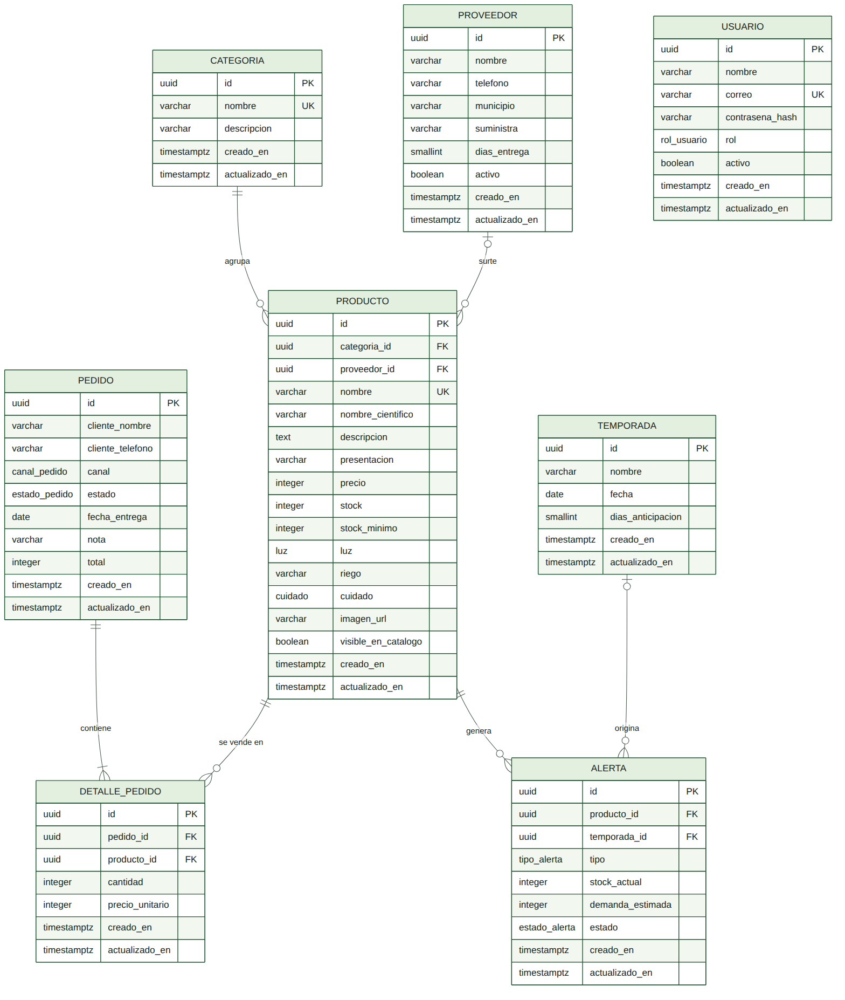
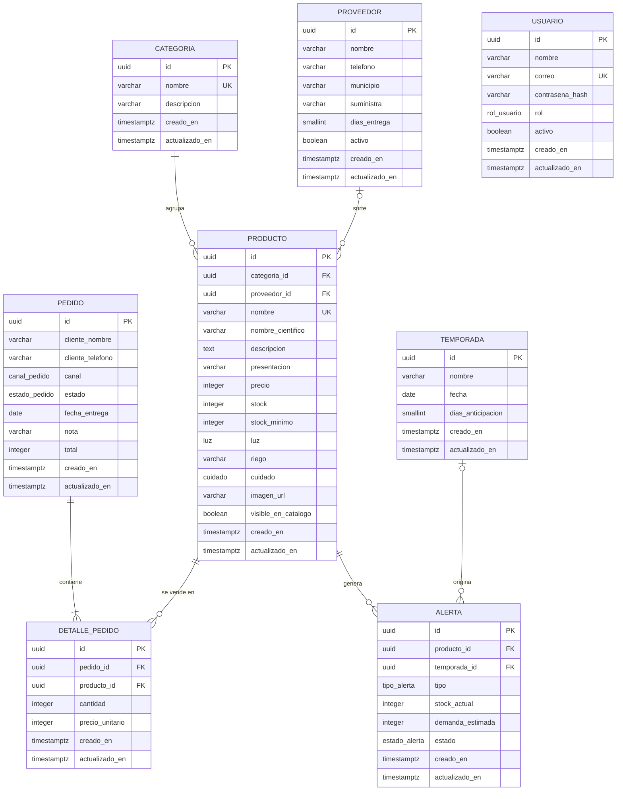

# Modelo de datos

Modelo relacional de Natutech para el Vivero Las Acacias (Yopal). Corresponde campo por campo con el contrato [`api/openapi.yaml`](../api/openapi.yaml); las pocas diferencias son deliberadas y están explicadas al final, en [Correspondencia con el contrato](#correspondencia-con-el-contrato).

## Motor: PostgreSQL 16

Los datos del vivero son relacionales y su integridad importa: un pedido descuenta stock de varios productos a la vez y eso tiene que pasar completo o no pasar (transacción), el precio vendido debe quedar congelado en cada línea, y reglas como "el stock nunca es negativo" o "no hay dos alertas activas iguales" se pueden garantizar en la propia base con `CHECK` e índices únicos. Además, la ruta A exige respaldos restaurados de verdad, y `pg_dump`/`pg_restore` lo resuelven sin herramientas extra. Con MongoDB todas esas garantías tendrían que vivir en el código de la aplicación.

## Convenciones

- Nombres de tablas y columnas en español, en singular y en `snake_case`, sin tildes.
- Llave primaria `id` de tipo `uuid`, generada con `gen_random_uuid()`. Se eligió UUID y no un entero autoincremental para que los identificadores no revelen cuántos pedidos o productos tiene el vivero y para poder generar ids en el cliente si algún día hace falta.
- Toda tabla tiene `creado_en` y `actualizado_en` (`timestamptz`, por defecto `now()`). `actualizado_en` lo mantiene un *trigger* en la Entrega 3.
- Precios y totales en pesos colombianos como `integer`. El peso no usa centavos en la práctica y los enteros evitan los errores de redondeo de los decimales en coma flotante.
- Los valores cerrados (luz, cuidado, estados...) son tipos `ENUM` de PostgreSQL.
- No hay campo de versión: la ruta A no tiene edición sin conexión ni sincronización, y con cuatro a seis personas usando el panel el riesgo de dos ediciones simultáneas del mismo producto es bajo. Si aparece, se agrega en una migración.

### Tipos enumerados

| Tipo | Valores |
|---|---|
| `luz` | `baja`, `media`, `alta` |
| `cuidado` | `facil`, `intermedio`, `avanzado` |
| `canal_pedido` | `whatsapp`, `tienda` |
| `estado_pedido` | `pendiente`, `confirmado`, `entregado`, `cancelado` |
| `tipo_alerta` | `stock_minimo`, `temporada` |
| `estado_alerta` | `activa`, `atendida`, `descartada` |
| `rol_usuario` | `administrador`, `empleado` |

## Entidades

### categoria

Agrupa los productos del catálogo (Interior, Exterior, Suculentas y cactus, Colgantes, Frutales, Macetas, Insumos).

| Atributo | Tipo | Nulo | Por defecto | Restricciones |
|---|---|---|---|---|
| `id` | `uuid` | No | `gen_random_uuid()` | PK |
| `nombre` | `varchar(40)` | No | | Único sin distinguir mayúsculas; entre 2 y 40 caracteres |
| `descripcion` | `varchar(200)` | Sí | | |
| `creado_en` | `timestamptz` | No | `now()` | |
| `actualizado_en` | `timestamptz` | No | `now()` | |

### proveedor

Quién le surte al vivero y cuánto tarda en llegar a Yopal.

| Atributo | Tipo | Nulo | Por defecto | Restricciones |
|---|---|---|---|---|
| `id` | `uuid` | No | `gen_random_uuid()` | PK |
| `nombre` | `varchar(80)` | No | | Entre 2 y 80 caracteres |
| `telefono` | `varchar(17)` | No | | Formato `+57 300 000 0000` (`CHECK` con expresión regular) |
| `municipio` | `varchar(60)` | No | | Entre 3 y 60 caracteres |
| `suministra` | `varchar(120)` | Sí | | Qué le vende al vivero |
| `dias_entrega` | `smallint` | No | `3` | Entre 0 y 60 |
| `activo` | `boolean` | No | `true` | Un proveedor se desactiva en lugar de borrarse |
| `creado_en` | `timestamptz` | No | `now()` | |
| `actualizado_en` | `timestamptz` | No | `now()` | |

### producto

Cada planta, matera o insumo que vende el vivero. Es la entidad central: la consultan el catálogo público, el inventario, los pedidos y las alertas.

| Atributo | Tipo | Nulo | Por defecto | Restricciones |
|---|---|---|---|---|
| `id` | `uuid` | No | `gen_random_uuid()` | PK |
| `categoria_id` | `uuid` | No | | FK → `categoria.id`, `ON DELETE RESTRICT` |
| `proveedor_id` | `uuid` | Sí | | FK → `proveedor.id`, `ON DELETE SET NULL` |
| `nombre` | `varchar(80)` | No | | Único sin distinguir mayúsculas; entre 2 y 80 caracteres |
| `nombre_cientifico` | `varchar(120)` | Sí | | Nulo en materas e insumos |
| `descripcion` | `text` | Sí | | Máximo 600 caracteres |
| `presentacion` | `varchar(60)` | No | | Tamaño o empaque: "Matera de 20 cm", "Bulto de 25 kg" |
| `precio` | `integer` | No | | Entre 0 y 5 000 000 |
| `stock` | `integer` | No | `0` | Entre 0 y 100 000 |
| `stock_minimo` | `integer` | No | `5` | Entre 0 y 10 000 |
| `luz` | `luz` | Sí | | Nulo en materas e insumos |
| `riego` | `varchar(60)` | Sí | | Texto corto: "2 veces por semana" |
| `cuidado` | `cuidado` | Sí | | Nulo en materas e insumos |
| `imagen_url` | `varchar(300)` | Sí | | Ruta relativa o URL de la foto |
| `visible_en_catalogo` | `boolean` | No | `true` | `false` oculta el producto del catálogo público sin borrarlo |
| `creado_en` | `timestamptz` | No | `now()` | |
| `actualizado_en` | `timestamptz` | No | `now()` | |

### pedido

Encargo o venta que el personal registra después de cerrarla por WhatsApp o en la tienda. El cliente no crea pedidos directamente: el catálogo lo lleva a WhatsApp.

| Atributo | Tipo | Nulo | Por defecto | Restricciones |
|---|---|---|---|---|
| `id` | `uuid` | No | `gen_random_uuid()` | PK |
| `cliente_nombre` | `varchar(80)` | No | | Entre 2 y 80 caracteres |
| `cliente_telefono` | `varchar(17)` | No | | Formato `+57 300 000 0000` |
| `canal` | `canal_pedido` | No | `'whatsapp'` | |
| `estado` | `estado_pedido` | No | `'pendiente'` | Transiciones validadas en la API |
| `fecha_entrega` | `date` | Sí | | Solo en encargos con fecha |
| `nota` | `varchar(300)` | Sí | | |
| `total` | `integer` | No | `0` | `>= 0`; suma de las líneas, la calcula el servidor |
| `creado_en` | `timestamptz` | No | `now()` | |
| `actualizado_en` | `timestamptz` | No | `now()` | |

### detalle_pedido

Una línea del pedido. Resuelve la relación muchos a muchos entre `pedido` y `producto`.

| Atributo | Tipo | Nulo | Por defecto | Restricciones |
|---|---|---|---|---|
| `id` | `uuid` | No | `gen_random_uuid()` | PK |
| `pedido_id` | `uuid` | No | | FK → `pedido.id`, `ON DELETE CASCADE` |
| `producto_id` | `uuid` | No | | FK → `producto.id`, `ON DELETE RESTRICT` |
| `cantidad` | `integer` | No | | Entre 1 y 1000 |
| `precio_unitario` | `integer` | No | | `>= 0`; copia del precio del producto al registrar el pedido |
| `creado_en` | `timestamptz` | No | `now()` | |
| `actualizado_en` | `timestamptz` | No | `now()` | |

Restricción adicional: `UNIQUE (pedido_id, producto_id)`. Si el cliente pide más unidades del mismo producto, se suma la cantidad en la misma línea.

### temporada

Fechas de alta demanda. Se registran por año porque el Día de la Madre y Amor y Amistad cambian de fecha cada año.

| Atributo | Tipo | Nulo | Por defecto | Restricciones |
|---|---|---|---|---|
| `id` | `uuid` | No | `gen_random_uuid()` | PK |
| `nombre` | `varchar(60)` | No | | Entre 3 y 60 caracteres |
| `fecha` | `date` | No | | |
| `dias_anticipacion` | `smallint` | No | `21` | Entre 1 y 90; desde cuántos días antes se revisan existencias |
| `creado_en` | `timestamptz` | No | `now()` | |
| `actualizado_en` | `timestamptz` | No | `now()` | |

Restricción adicional: `UNIQUE (nombre, fecha)`.

### alerta

Aviso de reabastecimiento. La genera el servidor (Entrega 3) en dos casos:

- `stock_minimo`: el `stock` de un producto quedó por debajo de su `stock_minimo`.
- `temporada`: una temporada entró en su ventana de anticipación y el stock no alcanza lo que se vendió en la misma ventana del año anterior (`demanda_estimada`, calculada con `detalle_pedido`).

Se guarda como tabla, y no se calcula al vuelo, para que el personal pueda marcarla como atendida y quede registro de cuándo se avisó.

| Atributo | Tipo | Nulo | Por defecto | Restricciones |
|---|---|---|---|---|
| `id` | `uuid` | No | `gen_random_uuid()` | PK |
| `producto_id` | `uuid` | No | | FK → `producto.id`, `ON DELETE CASCADE` |
| `temporada_id` | `uuid` | Sí | | FK → `temporada.id`, `ON DELETE CASCADE` |
| `tipo` | `tipo_alerta` | No | | |
| `stock_actual` | `integer` | No | | `>= 0`; stock en el momento del aviso |
| `demanda_estimada` | `integer` | Sí | | `>= 0`; solo en alertas de temporada |
| `estado` | `estado_alerta` | No | `'activa'` | |
| `creado_en` | `timestamptz` | No | `now()` | |
| `actualizado_en` | `timestamptz` | No | `now()` | |

Restricciones adicionales:

- `CHECK ((tipo = 'temporada') = (temporada_id IS NOT NULL))`: una alerta de temporada siempre dice cuál, y una de stock mínimo nunca.
- `CHECK (tipo = 'temporada' OR demanda_estimada IS NULL)`.

### usuario

Personal del vivero que entra al panel.

| Atributo | Tipo | Nulo | Por defecto | Restricciones |
|---|---|---|---|---|
| `id` | `uuid` | No | `gen_random_uuid()` | PK |
| `nombre` | `varchar(80)` | No | | |
| `correo` | `varchar(120)` | No | | Único sin distinguir mayúsculas |
| `contrasena_hash` | `varchar(255)` | No | | Hash bcrypt; nunca la contraseña en claro |
| `rol` | `rol_usuario` | No | `'empleado'` | |
| `activo` | `boolean` | No | `true` | |
| `creado_en` | `timestamptz` | No | `now()` | |
| `actualizado_en` | `timestamptz` | No | `now()` | |

## Relaciones

| Relación | Cardinalidad | Llave foránea | Al borrar el padre |
|---|---|---|---|
| categoria → producto | Uno a muchos: toda categoría tiene 0..n productos; todo producto tiene exactamente 1 categoría | `producto.categoria_id` | Se impide (`RESTRICT`) |
| proveedor → producto | Uno a muchos opcional: un proveedor surte 0..n productos; un producto tiene 0..1 proveedor principal | `producto.proveedor_id` | El producto queda sin proveedor (`SET NULL`) |
| pedido ↔ producto | Muchos a muchos, resuelta con `detalle_pedido` | | |
| pedido → detalle_pedido | Uno a muchos: todo pedido tiene 1..n líneas | `detalle_pedido.pedido_id` | Se borran las líneas (`CASCADE`) |
| producto → detalle_pedido | Uno a muchos: un producto aparece en 0..n líneas | `detalle_pedido.producto_id` | Se impide (`RESTRICT`); por eso `DELETE /productos/{id}` responde 409 si el producto ya se vendió |
| producto → alerta | Uno a muchos | `alerta.producto_id` | Se borran sus alertas (`CASCADE`) |
| temporada → alerta | Uno a muchos opcional: solo las alertas de tipo `temporada` | `alerta.temporada_id` | Se borran sus alertas (`CASCADE`) |

`usuario` no se relaciona con las demás tablas en esta versión. Si más adelante se necesita saber quién registró cada pedido, se agrega `pedido.registrado_por` como llave foránea.

## Índices

Además de las llaves primarias (que PostgreSQL indexa solo), se crean estos:

| Índice | Columnas | Por qué |
|---|---|---|
| `uq_categoria_nombre` | `UNIQUE (lower(nombre))` en `categoria` | Evita "Interior" e "interior" como categorías distintas |
| `uq_producto_nombre` | `UNIQUE (lower(nombre))` en `producto` | Evita productos repetidos (la API responde 409) y sirve para ordenar el catálogo por nombre |
| `idx_producto_categoria` | `categoria_id` en `producto` | Filtro por categoría del catálogo y del inventario |
| `idx_producto_proveedor` | `proveedor_id` en `producto` | PostgreSQL no indexa solas las llaves foráneas; sin este índice, desactivar o borrar un proveedor recorre toda la tabla |
| `uq_detalle_pedido` | `UNIQUE (pedido_id, producto_id)` en `detalle_pedido` | Una línea por producto en cada pedido; además sirve para traer las líneas de un pedido |
| `idx_detalle_producto` | `producto_id` en `detalle_pedido` | Cálculo de `demanda_estimada` (ventas de un producto en una ventana de fechas) y verificación de si un producto ya se vendió antes de borrarlo |
| `idx_pedido_creado_en` | `creado_en DESC` en `pedido` | El listado de pedidos se ordena del más reciente al más antiguo y se filtra por `desde`/`hasta` |
| `uq_temporada` | `UNIQUE (nombre, fecha)` en `temporada` | No registrar dos veces la misma fecha |
| `idx_temporada_fecha` | `fecha` en `temporada` | El proceso de alertas busca las temporadas que se acercan |
| `uq_alerta_activa` | `UNIQUE NULLS NOT DISTINCT (producto_id, tipo, temporada_id) WHERE estado = 'activa'` en `alerta` | El proceso de alertas corre todos los días; esto impide que cree la misma alerta activa dos veces |
| `idx_alerta_estado` | `(estado, creado_en DESC)` en `alerta` | El panel lista las alertas activas, las más recientes primero |
| `uq_usuario_correo` | `UNIQUE (lower(correo))` en `usuario` | Inicio de sesión por correo sin importar mayúsculas |

No se indexa la búsqueda por texto (`q`): con menos de quinientos productos, un recorrido secuencial con `ILIKE` tarda menos de un milisegundo. Si el catálogo crece mucho se evalúa un índice `pg_trgm`.

Tampoco se indexa `pedido.estado` por sí solo: tiene cuatro valores y poca selectividad.

## Correspondencia con el contrato

Cada esquema del contrato usa los mismos nombres de campo que su tabla.

| Tabla | Esquemas del contrato |
|---|---|
| `categoria` | `Categoria` |
| `producto` | `Producto` (todos los campos), `ProductoPublico` (subconjunto para el catálogo), `ProductoCampos`, `ProductoEntrada` y `ProductoCambios` (lo que se envía al crear o editar) |
| `proveedor` | `Proveedor`, `ProveedorCampos`, `ProveedorEntrada`, `ProveedorCambios` |
| `pedido` | `Pedido`, `PedidoEntrada`, `PedidoCambios` |
| `detalle_pedido` | `DetallePedido`, `DetallePedidoEntrada` (va dentro de `Pedido.detalles`) |
| `temporada` | `Temporada`, `TemporadaCampos`, `TemporadaEntrada` |
| `alerta` | `Alerta`, `AlertaCambios` |
| `usuario` | `Usuario` |

Diferencias deliberadas:

| En el modelo pero no en el contrato | Por qué |
|---|---|
| `usuario.contrasena_hash` | Nunca sale de la API. El contrato recibe `contrasena` (marcada `writeOnly`) en `Credenciales` y el servidor guarda solo su hash |

| En el contrato pero no en el modelo | Por qué |
|---|---|
| `Credenciales.contrasena` | Es una entrada; se convierte en `usuario.contrasena_hash` y nunca se guarda en claro |
| `Sesion.token`, `Sesion.expira_en` | El JWT no tiene estado en el servidor: se firma y se verifica, no se guarda |
| `Paginacion` (`pagina`, `por_pagina`, `total`) y `Error` | Envoltorios de las respuestas, no entidades del dominio |

## Fuente del diagrama

El PNG se genera con [Mermaid](https://mermaid.js.org/). GitHub también dibuja este bloque directamente:

