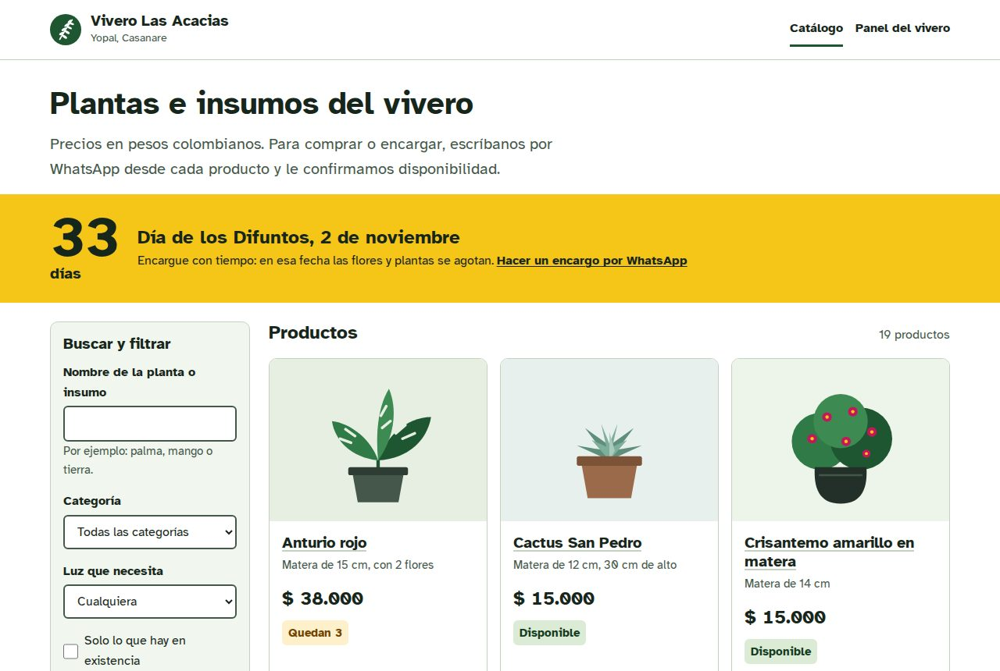
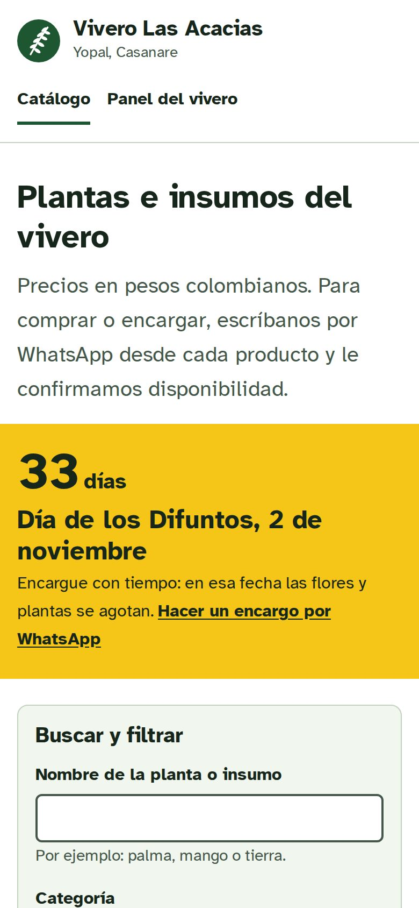
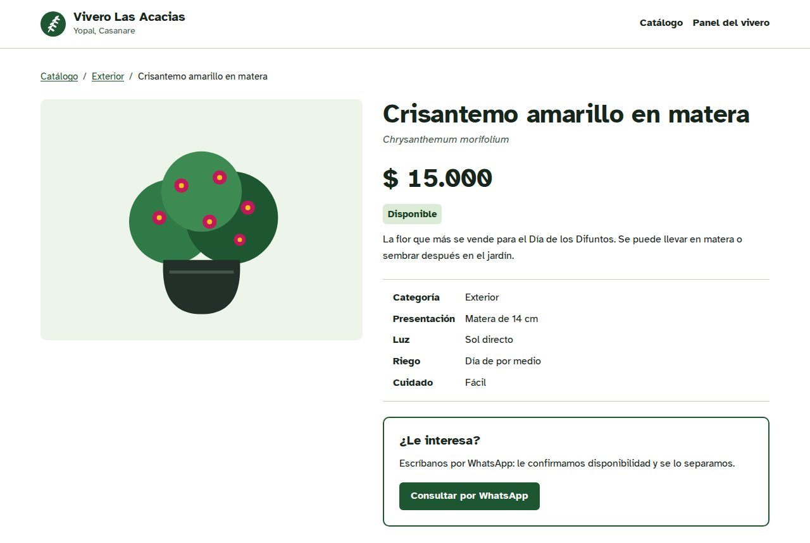
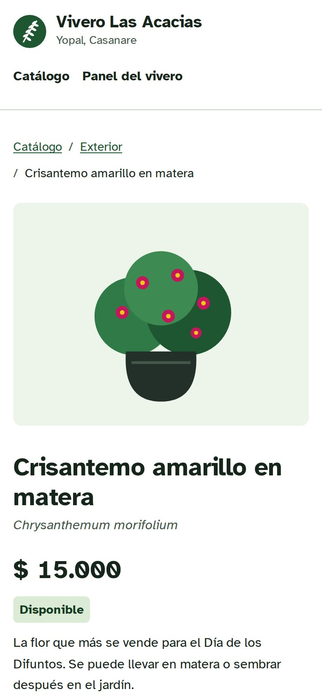
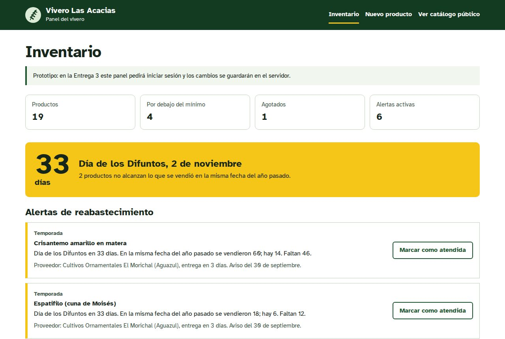
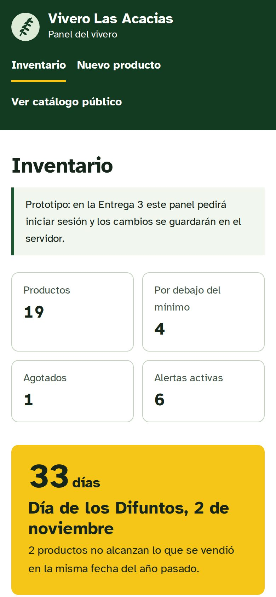
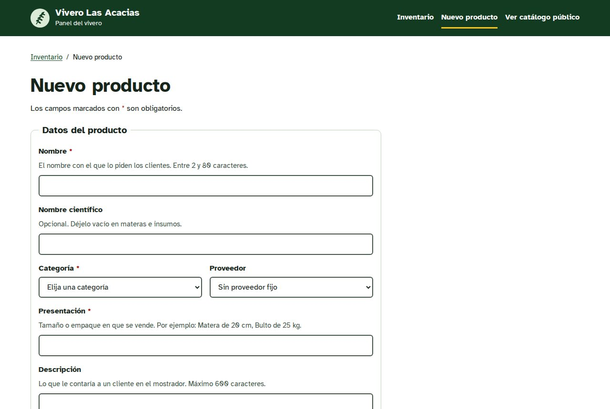
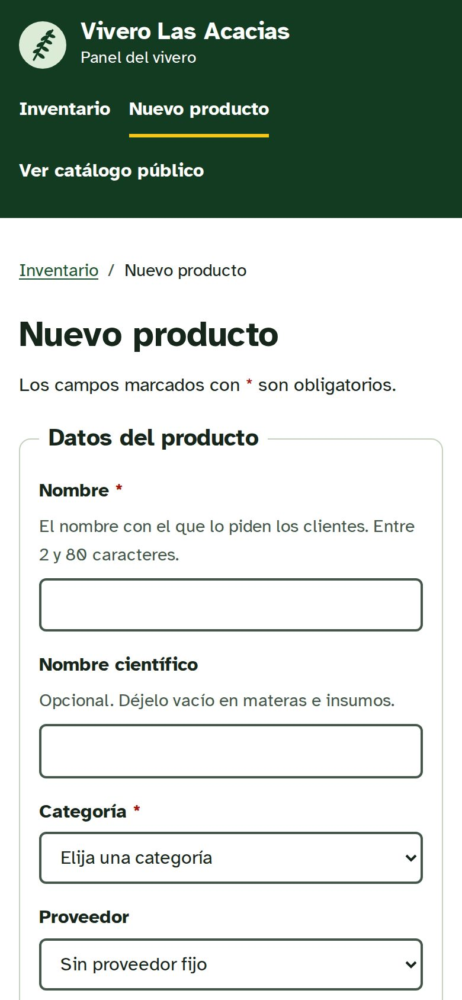
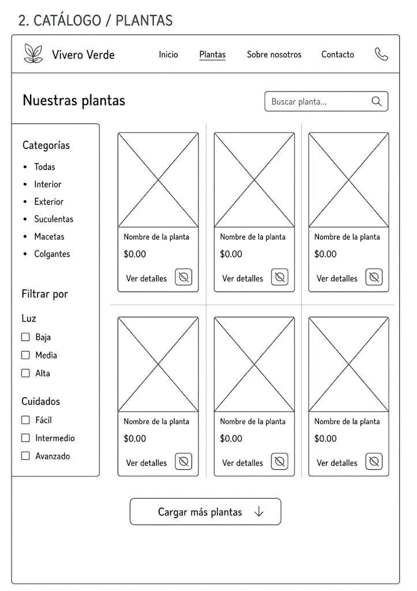

# Wireframes y prototipo

Los wireframes de la Entrega 1 (dibujados a mano y en herramienta digital) y las capturas del prototipo navegable de la Entrega 2 que salió de ellos.

## De los wireframes al prototipo

| Wireframe (Entrega 1) | Pantalla del prototipo (Entrega 2) | Qué cambió y por qué |
|---|---|---|
| Inicio y Vista de usuario | [Catálogo público](../../web/index.html) | El carrusel de imágenes se reemplazó por la cuenta regresiva a la próxima temporada: es la información que de verdad le sirve al cliente y al vivero, y un carrusel es difícil de usar con teclado y con lector de pantalla. Inicio y catálogo se unieron en una sola pantalla para que el cliente llegue a los productos sin pasos intermedios. |
| Catálogo de plantas | [Catálogo público](../../web/index.html) | Se mantuvieron la búsqueda, el filtro por categoría y el filtro por luz. Se agregó "solo lo que hay en existencia", porque el dueño contó que ha perdido ventas por no saber qué tiene. El filtro por nivel de cuidado pasó al detalle. |
| Detalle de planta | [Detalle del producto](../../web/detalle.html) | Igual que el wireframe: precio, descripción, luz, riego, cuidado, botón de WhatsApp y otras plantas de la misma categoría. Se agregó la presentación (tamaño de matera o bolsa) y el aviso de agotado. |
| Panel de administración y Productos (admin) | [Inventario del vivero](../../web/inventario.html) | Las tarjetas de "productos más vistos" y "usuarios" se cambiaron por lo que pidió el dueño en la encuesta: cuántos productos están por debajo del mínimo, cuántos agotados y qué alertas de reabastecimiento hay antes de cada temporada. |
| (no había) | [Formulario de producto](../../web/producto-form.html) | Nueva. Es donde el vivero registra o edita un producto, con todos los campos del modelo de datos y validaciones visibles. |
| Consultas por WhatsApp | Entrega 3 | El registro de pedidos queda especificado en el contrato (`/pedidos`) y se construye con el backend. |
| Sobre nosotros | Fuera del alcance | No resuelve el problema del inventario. Se puede agregar al final si sobra tiempo. |

Los wireframes usaban el nombre provisional "Vivero Verde". El prototipo ya usa el nombre real del cliente, Vivero Las Acacias.

## Capturas del prototipo

| Pantalla | Escritorio | Celular |
|---|---|---|
| Catálogo público |  |  |
| Detalle del producto |  |  |
| Inventario |  |  |
| Formulario de producto |  |  |

## Wireframes de la Entrega 1

### Versión celular

| Pantalla | Wireframe |
|---|---|
| Inicio |  |
| Catálogo de plantas |  |
| Detalle de planta |  |
| Sobre nosotros |  |
| Productos (administración) |  |
| Consultas por WhatsApp |  |

### Versión escritorio

| Pantalla | Wireframe |
|---|---|
| Vista de usuario |  |
| Panel de administración |  |
